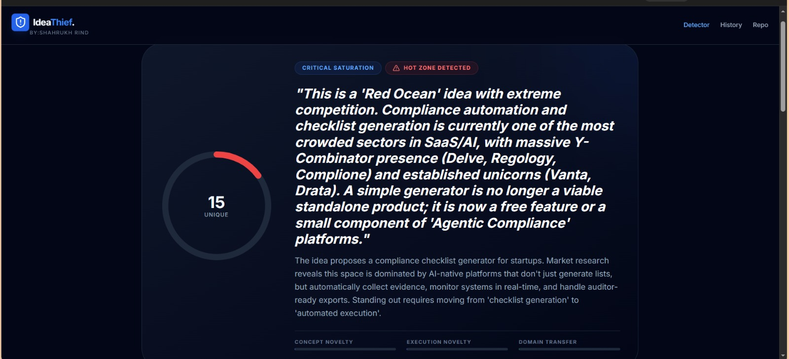
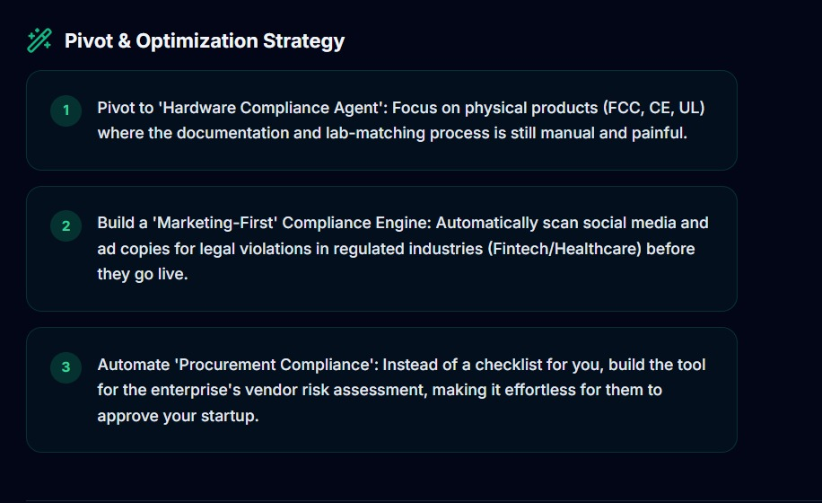

<div align="center">

# 🛡️ IdeaThief Detector

### AI-Powered Startup Originality & Competition Intelligence Platform

Analyze startup ideas, discover similar products, identify market saturation, visualize idea lineage, and receive actionable recommendations before investing months into building.

<br>


</div>

---

# Overview

Building a startup without validating your idea is one of the biggest reasons founders waste months building products that already exist.

**IdeaThief Detector** is an AI-powered research platform that analyzes startup ideas across GitHub repositories and public software ecosystems to estimate originality, market competition, execution risk, and innovation opportunities.

Instead of answering only **"Has someone built this?"**, the platform answers:

- How unique is this idea?
- Who are the competitors?
- Which concepts inspired it?
- What features are already saturated?
- Where is the market gap?
- How can this idea become more defensible?

The goal is to provide founders with actionable intelligence before writing thousands of lines of code.

---

# Demo

<p align="center">

</p>

---

# Features

| Feature | Description |
|----------|-------------|
| 🤖 AI Idea Analysis | Deep startup analysis using Google's Gemini model |
| 🔍 Repository Intelligence | Searches public repositories for similar projects |
| 📈 Originality Score | Estimates uniqueness of the submitted idea |
| 🌊 Market Saturation Detection | Detects Red Ocean vs Blue Ocean opportunities |
| 🌳 Idea Lineage Visualization | Shows ancestor concepts and competitive siblings |
| ⚠ Risk Detection | Highlights execution and market risks |
| 💡 Improvement Suggestions | AI-generated recommendations to differentiate ideas |
| 📚 Local Repository Registry | Save and manage analyzed projects locally |
| ⚡ Fast Analysis | Complete reports generated within seconds |
| 🎨 Modern Dashboard | Clean dark interface built for productivity |

---

# Screenshots

## Home

<p align="center">

</p>

---

## Local Repository

<p align="center">

</p>

---

## AI Analysis Report

<p align="center">

</p>

---

## Idea Lineage Visualization

<p align="center">

</p>

---

# How It Works

```
User Idea
      │
      ▼
Idea Processing
      │
      ▼
Repository Search
      │
      ▼
AI Market Analysis
      │
      ▼
Competition Detection
      │
      ▼
Idea Lineage Mapping
      │
      ▼
Risk Assessment
      │
      ▼
Final Intelligence Report
```

---

# Tech Stack

| Category | Technology |
|-----------|------------|
| Frontend | React |
| Language | TypeScript |
| Build Tool | Vite |
| Styling | CSS |
| AI Model | Google Gemini API |
| Repository Analysis | GitHub API |
| Runtime | Node.js |

---

# Project Structure

```text
IdeaThief-Detector/
│
├── api/
│   ├── analyzeIdea.ts
│   ├── githubSearch.ts
│   └── ...
│
├── components/
│   ├── Dashboard/
│   ├── Analysis/
│   ├── Repository/
│   ├── Charts/
│   └── UI/
│
├── services/
│   ├── geminiService.ts
│   ├── githubService.ts
│   └── repositoryService.ts
│
├── App.tsx
├── index.tsx
├── index.html
├── package.json
├── vite.config.ts
└── README.md
```

---

# Installation

## Clone Repository

```bash
git clone https://github.com/Shahrukh-aidev/IdeaThief-Detector.git
```

```bash
cd IdeaThief-Detector
```

---

## Install Dependencies

```bash
npm install
```

---

## Configure Environment

Create a `.env` file.

```env
GEMINI_API_KEY=YOUR_API_KEY
GITHUB_TOKEN=YOUR_GITHUB_TOKEN
```

---

## Start Development Server

```bash
npm run dev
```

---

Open

```
http://localhost:5173
```

---

# Example Workflow

1. Enter your startup idea.
2. Submit the project for analysis.
3. The system searches similar repositories.
4. Gemini evaluates originality.
5. Competition is identified.
6. Risks are highlighted.
7. Improvement suggestions are generated.
8. A complete intelligence report is displayed.

---

# Future Improvements

- GitLab support
- Bitbucket support
- Patent database integration
- Startup funding analysis
- YC startup comparison
- Product Hunt integration
- Semantic repository embeddings
- Multi-agent evaluation
- PDF report export
- Team collaboration
- User authentication
- Cloud synchronization

---

# Why This Project Exists

Many developers spend months building products only to discover that similar solutions already dominate the market.

IdeaThief Detector was built to reduce that risk by providing AI-assisted competitive intelligence before development begins.

Rather than replacing creativity, it helps founders identify opportunities where genuine innovation still exists.

---

# License

This project is licensed under the MIT License.

---

<div align="center">

### ⭐ If you found this project useful, consider giving it a star.

Made with ❤️ by **Shahrukh Rind**

</div>
